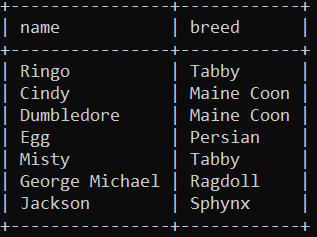
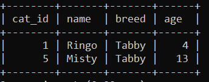
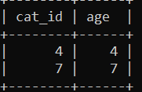

# MYSQL | Practice 3

## Introduction


## Requirements

- Fork this repo
- Clone this repo
## Submission

- Upon completion, run the following commands

  ```
  git add .
  git commit -m "message"
  git push origin main
  ```

- Create Pull Request so your teachers can check up your work.

## Deliverables

Write your sql code in `exersice-3.sql`.

### Iteration 1: Execute cats_sore.sql 

Execute de script cats_store.sql

### Iteration 2:  
Write the SQL that selects the following


### Iteration 3: 
Write the SQL that selects the following

### Iteration 4: 
Write the SQL that selects all the cats with the Tabby breed

### Iteration 5: 
Write the SQL that selects all the cats where cat_id is same as age


